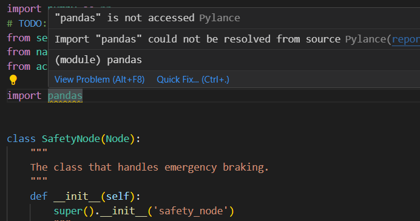
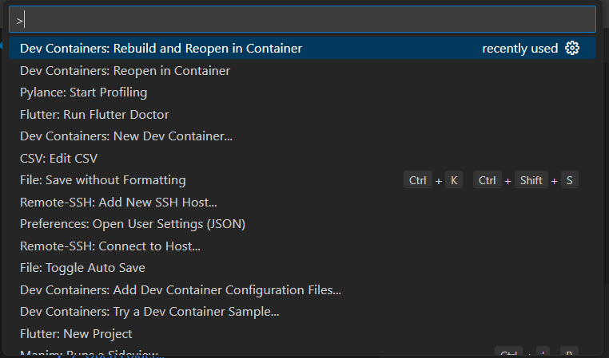
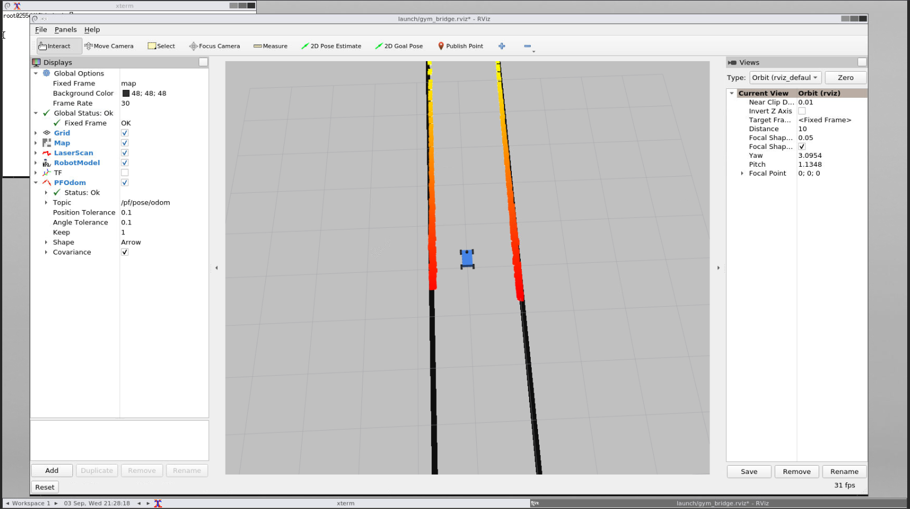

# f1tenth_sim - VS Code Integration Using Dev Containers

This repository provides a dev container workspace for the [UNLV F1 course](https://github.com/unlv-f1) course.

## Background

**Docker** allows software to be run in lightweight "containers," which contain all of the necessary libraries and tools needed for it to run correctly. In our use case, we are using a Docker container so we can replicate an Ubuntu 20.04 enviroment equipped with ROS2 Foxy software. One way to think of Docker containers is that they are much lighter forms of Virtual Machine images.

**VS Code Dev Containers** is the official extension for using Docker containers in VS Code. This is quite useful in our use case, since it provides:

- A more convenient way of building and entering containers through a GUI.
- A graphical text editor interface inside the container.
- Access to VS Code extensions, such as type checkers and linters, which can be greatly helpful for the development experience. (These are automatically installed after building.)

For example, if you are coding Python in the dev container, the VS Code extension Pylance helps can help catch errors more quickly, as shown below:



## Installation

First, install each of the following:

- [VS Code](https://code.visualstudio.com/)
- [Docker](https://www.docker.com/)
- [VS Code Dev Containers](https://marketplace.visualstudio.com/items?itemName=ms-vscode-remote.remote-containers)

> **Tip**: Consider configuring Docker to have it start on system startup, so you don't need to manually start the Docker daemon.

Next, clone this repository onto your machine (Make sure to include `--recurse-submodules`!):

```
git clone --recurse-submodules https://github.com/ederic-oytas/f1tenth_sim.git
```

Afterward, open the folder in VS Code. If you added VS Code to the command line, you can use:

```
code f1tenth_sim
```

You should see VS Code open the folder **locally** on your computer, as shown below:


Next, we will enter the container. Use the **Command Palette** (`Ctrl+Shift+P` or View > Command Palette) and click "Dev Containers: Rebuild and Reopen in Container", as shown below:



VS Code should start building the container, which will take several minutes, depending on the performance of your machine. Once it's finished building, VS Code will open the container as shown below:


Congratulations! VS Code has successfully built the container! The next sections will guide you on how to use the container and perform some functions.

## Entering and Exiting the Container

When you are **outside** the container, use the **Command Palette** (`Ctrl+Shift+P`) to enter the container using VS Code. Here are two useful commands:

- **Dev Containers: Reopen in Container**: Make the current VS Code window enter the dev container.
- **Dev Containers: Rebuild and reopen in Container**: First, rebuild the container, then make the current VS Code window enter the dev container. 

When **inside** the container, use the **Command Palette** (`Ctrl+Shift+P`) to exit the container using:

- **Dev Containers: Reopen Folder Locally**: Make the current VS Code window reopen the folder locally.

## Launching a Terminal

Launching a terminal has also been made easier. To launch a terminal, either use ```Ctrl+Shift+` ``` or use Terminal > New Terminal. A new terminal will appear at the bottom of your window:


For convenience, the terminal automatically sources ROS2 and all `local_setup.bash` files located within the install directories of the lab workspaces and `sim_ws/` workspaces.

To kill the terminal, click the Garbage Can icon in the top-right of the terminal pane.

## Viewing the Desktop

While the container is running, another container runs **noVNC** to run a desktop interface inside the container. To access this, use a web browser and go to `http://localhost:8080/vnc.html`. You should see the following screen:


Press "Connect" and it will take you to the desktop inside in the container:


## Re-sourcing the workspaces

Each terminal automatically sources the ROS2 workspaces upon start up. If you still need to re-source the workspace, you can use:

```
sw
```

This will rerun the commands done at the beginning of the terminal session.

This can be useful if you have added or installed any new packages.

## Running the Gym

This container provides a custom launch file for running the gym to make swapping between maps easier. First, navigate to the `sim_ws/` folder:

```bash
cd /root/sim_ws/
```

Then, execute the command to start the gym:

```bash
ros2 launch launch/gym_launch.py
```

On the desktop, it should show the gym running:



> Note: It will take several seconds before everything is fully running.

## Setting Pose in the Gym

To set the car's pose (position+angle) in the gym, use "2D Pose Estimate" and drag an arrow anywhere on the map to set the car's new pose. 


## Manual Control in the Gym

To control the car manually, first launch a new terminal. Then run:

```bash
ros2 run teleop_twist_keyboard teleop_twist_keyboard
```

This will run a node which sends controls to the car to drive manually:


This can be useful to stop the car after running some code.

## Using a Different Map in the Gym

Maps are stored in `sim_ws/maps`. To switch maps, you need to specify two arguments:

- `map_path`: Path to the new map (with no file extension)
- `map_img_ext`: Extension of the new map (typically `.png` or `.pgm`). If not given, this defaults to `.png`.

The command is structured like this:

```bash
# inside sim_ws/
ros2 launch launch/gym_launch.py map_path:=<map path> map_img_ext:=<map extension>
```

> Note: The map_path is relative to your current directory.

For example, if we want to use the Spielberg map, then we would use:

```bash
ros2 launch launch/gym_launch.py map_path:=maps/Spielberg_map map_img_ext:=.png
```

Or more tersely (since the default value of `map_img_ext` is `.png`):

```bash
ros2 launch launch/gym_launch.py map_path:=maps/Spielberg_map
```

Alternatively, you can edit `gym_launch.py` directly to change the default values.

## Modifying Gym Config

The `sim_ws/launch/gym_launch.py` file uses the `sim_ws/config/gym_sim.yaml` config file by default. You can modify this file if you want to change any parameters.
